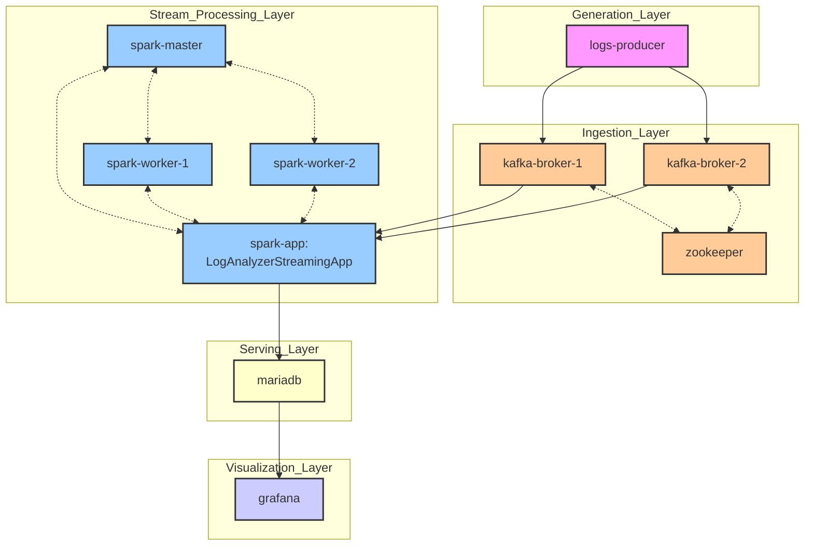

# big-data-engineering

This project implements a big data engineering use case, that processes server logs through five distinct layers. The system generates synthetic logs in the Generation Layer, ingests them through Apache Kafka in the Ingestion Layer, processes them using a distributed Apache Spark cluster in the Stream Processing Layer, stores the processed data in MariaDB in the Serving Layer, and visualizes the results using Grafana in the Visualization Layer.

## Project Overview

- **Generation Layer**: Produces simulated server logs using a Python-based logs producer.
- **Ingestion Layer**: Routes data through Kafka brokers (managed by Zookeeper) for reliable message queuing.
- **Stream Processing Layer**: Processes streaming data using Spark master-worker cluster architecture.
- **Serving Layer**: Persists processed log data in MariaDB for storage and retrieval.
- **Visualization Layer**: Presents data insights through Grafana dashboards.

## System Architecture



## Getting Started

### Prerequisites

- Docker
- Docker Compose

### Quick Start

1. **Clone the Repository**
    ```bash
    git clone https://github.com/SchierleLukas/big-data-engineering.git
    cd big-data-engineering
    ```

2. **Start All Services**
    ```bash
    docker-compose up -d
    ```
    Ensure Docker and Docker Compose are installed and running. This command will build and start all of the containers, defined in the [`docker-compose.yml`](docker-compose.yml).

3. **Access the Grafana Dashboard**
    - Open `http://localhost:3000` in your browser and use the default credentials `admin`/`admin` to log in.

## Implementation Notes

This implementation uses Docker Compose to simulate a distributed system on a single machine:

- **Local Simulation**: All services run as containers on one host, not truly distributed
- **Data Persistence**: Data is not persisted between container restarts:
  - Kafka messages are lost when brokers restart
  - MariaDB data is volatile unless volumes are configured
  - Grafana dashboards reset on container recreation
- **Development Purpose**: This setup is intended for development and testing, not production use

## License

This project is licensed under the [Creative Commons Attribution-NonCommercial-ShareAlike 4.0 International License](https://creativecommons.org/licenses/by-nc-sa/4.0/).
