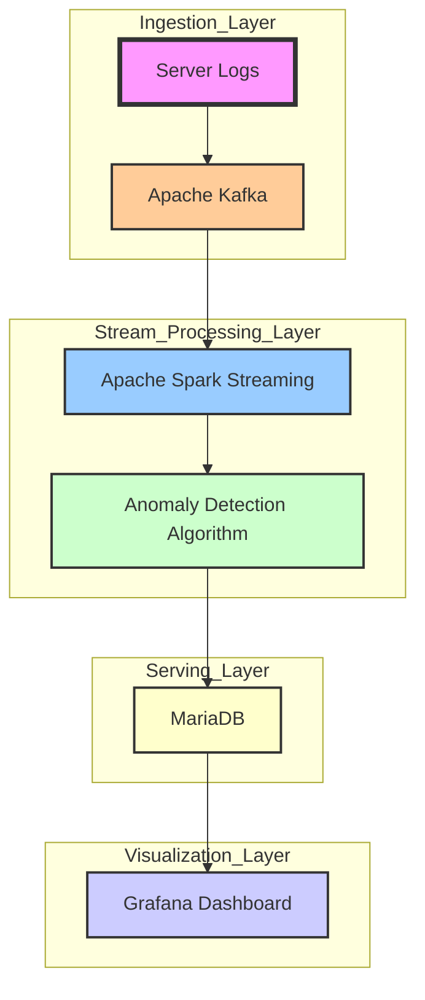

# big-data-engineering

This project implements a big data pipeline for real-time anomaly detection using server logs. The system ingests logs through Apache Kafka, processes them with Apache Spark Streaming, detects anomalies, stores the results in MariaDB, and visualizes the data using Grafana.

## Project Overview

- **Ingestion Layer**: Captures and streams server logs into Kafka topics.
- **Stream Processing Layer**: Uses Spark Streaming to process log data and apply anomaly detection algorithms.
- **Serving Layer**: Stores processed data in MariaDB for persistence and querying.
- **Visualization Layer**: Utilizes Grafana to display real-time analytics and trends.

## System Architecture



## Getting Started

### Prerequisites

- Docker
- Docker Compose

### Quick Start

1. **Clone the Repository**
    ```bash
    git clone https://github.com/SchierleLukas/big-data-engineering.git
    cd big-data-engineering
    ```

2. **Start All Services**
    ```bash
    docker-compose up -d
    ```
    Ensure Docker and Docker Compose are installed and running. This command will build and start Kafka, Spark, MariaDB, and Grafana.

3. **Access the Grafana Dashboard**
    - Open `http://localhost:3000` in your browser to monitor anomalies. Use the default credentials `admin`/`admin` to log in.


## License

This project is licensed under the [Creative Commons Attribution-NonCommercial-ShareAlike 4.0 International License](https://creativecommons.org/licenses/by-nc-sa/4.0/).
